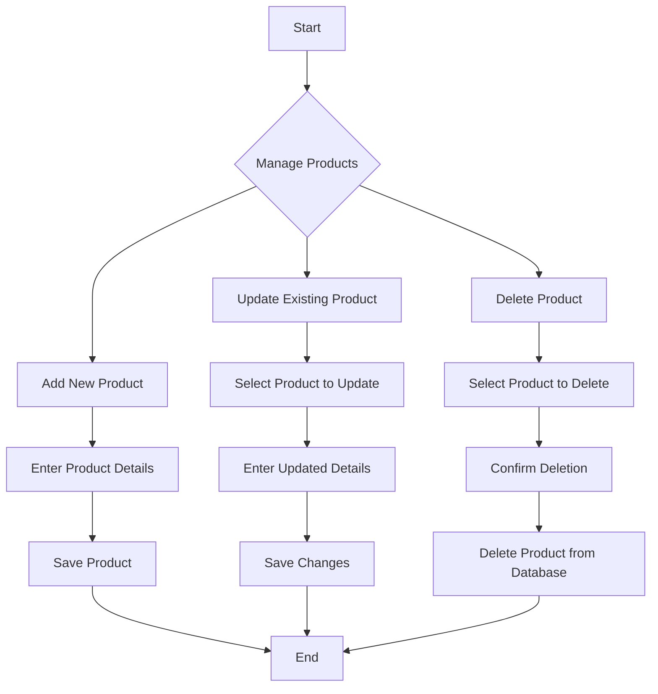
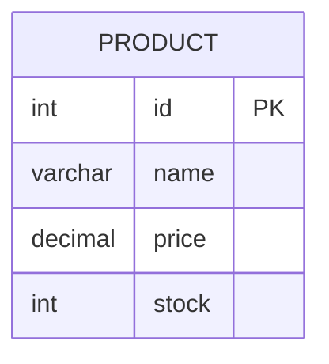

# Master Product Documentation

This document describes the structure and management of master products in the POS application.

## Product Attributes

A master product has the following attributes:

*   **id:** A unique identifier for the product.
*   **name:** The name of the product.
*   **price:** The price of the product.
*   **stock:** The quantity of the product in stock.

## Product Management Flowchart

## Database Entity Relationship Diagram (ERD)

